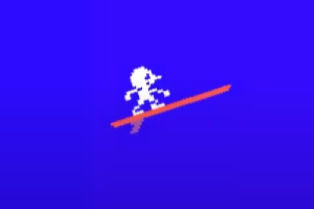

<h2>Server Surfer (Neon Cloud)</h2>
<h4>A 2D ZEN-dless runner</h4>

 

---

<h3>Synopsis</h3> 

You are the Server Surfer! Surf the wave forms of the data stream.

Collect loot, reach root, or get the reboot.

<h3>Showcases</h3>

- Unity Engine
- C#
- Dependency Injection
  - Scriptable Objects as a state machine
- Dynamic enemy behavior
  - Drag and drop flight patterns onto enemies to alter behavior at run-time.
- Gameplay design
  - Character can take on 3 stances that affect the control of the board.
- Linear Interpolation
  - Background is a series of panels lerped over a chosen color scheme.

<h3>Shortcomings</h3>

- Functionality spread over multiple branches
- Not fully packaged game
  - Needs assembly of various scenes
- Created with outdated skill-level

<h3>Progress Videos</h3>

<blockquote>3-stance mechanic and flight-path</blockquote>

            <iframe width="100%" height="400" src="https://www.youtube.com/embed/cOl0YcgvyA0?si=DV5msCV0-Xeq4_Iy"
                title="YouTube video player" frameborder="0"
                allow="accelerometer; autoplay; clipboard-write; encrypted-media; gyroscope; picture-in-picture; web-share"
                allowfullscreen>
            </iframe>
            

<blockquote>Converted player character to my own design</blockquote>

            <iframe width="100%" height="400" src="https://www.youtube.com/embed/2yQsls8u0wg?si=DV5msCV0-Xeq4_Iy"
                title="YouTube video player" frameborder="0"
                allow="accelerometer; autoplay; clipboard-write; encrypted-media; gyroscope; picture-in-picture; web-share"
                allowfullscreen>
            </iframe>
            

<blockquote>Created more asthetically appealng movement for player</blockquote>

            <iframe width="100%" height="400" src="https://www.youtube.com/embed/kCTCbXfQMr0?si=DV5msCV0-Xeq4_Iy"
                title="YouTube video player" frameborder="0"
                allow="accelerometer; autoplay; clipboard-write; encrypted-media; gyroscope; picture-in-picture; web-share"
                allowfullscreen>
            </iframe>
            

<blockquote>Introduced flight patterns</blockquote>

            <iframe width="100%" height="400" src="https://www.youtube.com/embed/ghEL2NIQV_0?si=DV5msCV0-Xeq4_Iy"
                title="YouTube video player" frameborder="0"
                allow="accelerometer; autoplay; clipboard-write; encrypted-media; gyroscope; picture-in-picture; web-share"
                allowfullscreen>
            </iframe>
            

<blockquote>More on flight patterns</blockquote>

            <iframe width="100%" height="400" src="https://www.youtube.com/embed/TxkyfSkyaFY?si=DV5msCV0-Xeq4_Iy"
                title="YouTube video player" frameborder="0"
                allow="accelerometer; autoplay; clipboard-write; encrypted-media; gyroscope; picture-in-picture; web-share"
                allowfullscreen>
            </iframe>
            

<blockquote>Looped enemy via custom event triggers</blockquote>

            <iframe width="100%" height="400" src="https://www.youtube.com/embed/c8jDT2u8Ty0?si=DV5msCV0-Xeq4_Iy"
                title="YouTube video player" frameborder="0"
                allow="accelerometer; autoplay; clipboard-write; encrypted-media; gyroscope; picture-in-picture; web-share"
                allowfullscreen>
            </iframe>
            

<blockquote>Introduced project originally as Flappy Koopa</blockquote>

            <iframe width="100%" height="400" src="https://www.youtube.com/embed/3BDFBor0CzU?si=DV5msCV0-Xeq4_Iy"
                title="YouTube video player" frameborder="0"
                allow="accelerometer; autoplay; clipboard-write; encrypted-media; gyroscope; picture-in-picture; web-share"
                allowfullscreen>
            </iframe>
            

